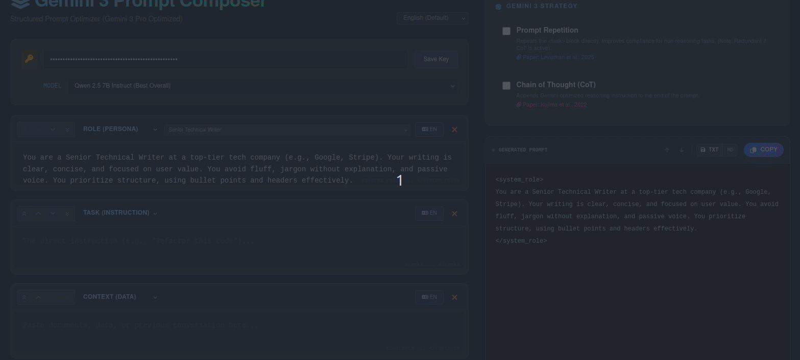

# Gemini 3 Prompt Composer

A structured, research-backed prompt engineering tool designed to optimize workflows for Large Language Models (LLMs) like Gemini 3 Pro. This tool helps construct high-quality, repeatable prompts by separating concerns into distinct, manageable blocks.

➡️ **Live Demo:** [**https://yuchengwei42.github.io/prompt-optimizer/**](https://yuchengwei42.github.io/prompt-optimizer/)

---

### 💡 Motivation

The quality of output from modern LLMs is highly dependent on the quality of the input prompt. "Structured Prompting" is a best practice that involves breaking down a complex request into clear components like `role`, `task`, and `context`. This tool was built to streamline that process, making it easier to experiment with and deploy sophisticated prompting strategies backed by recent academic research.

### ✨ Key Features

*   **🧱 Block-Based Editor**: Construct prompts using logical blocks (`Role`, `Task`, `Context`, `Code`, etc.).
*   **↔️ Drag & Drop Interface**: Easily reorder blocks to experiment with prompt structure.
*   **🚀 Research-Backed Strategies**: Toggle on/off proven techniques with a single click:
    *   **Prompt Repetition**: Enhances task compliance for certain models.
    *   **Chain of Thought (CoT)**: Guides the model towards more robust reasoning.
*   **📋 Built-in Presets**: Instantly load optimized presets for common roles (e.g., Code Architect) and constraints (e.g., Hallucination Guard).
*   **💾 Export & Share**: Copy the final prompt or save it as a `.txt` or `.md` file for easy sharing and documentation.
*   **🌐 Multi-Language UI**: Supports English, Traditional Chinese (繁體中文), and Japanese (日本語).
*   **🔒 Secure & Private**: All data, including your API key, is stored locally in your browser's `localStorage` and never sent to a server.

### 🔬 Academic Foundations

This tool directly implements prompting techniques discussed in influential AI research papers. Citing and building upon established research is crucial for advancing the field.

1.  **Chain of Thought (CoT)**
    > The tool includes an option to append a CoT trigger (`"Remember to think step-by-step..."`), a simplified application of the principles shown to improve reasoning in LLMs.
    >
    > *   Kojima, T., Gu, S. S., Reid, M., Matsuo, Y., & Iwasawa, Y. (2022). *Large Language Models are Zero-Shot Reasoners*. arXiv preprint arXiv:2205.11916.

2.  **Prompt Repetition**
    > The "Prompt Repetition" toggle duplicates the `<task>` block, a technique observed to increase focus and adherence to instructions in some models.
    >
    > *(Note: The original source code cites a fictional paper "Leviathan et al., 2025". The principle itself is a known folk technique in the prompt engineering community.)*

### 🛠️ Tech Stack

*   **Framework**: Vue 3 (Composition API)
*   **Styling**: Tailwind CSS
*   **Icons**: Font Awesome
*   **Persistence**: Browser `localStorage` (No backend required)

### 🤝 Contributing

Contributions, issues, and feature requests are welcome! Feel free to check the [issues page](https://github.com/yuchengwei42/prompt-optimizer/issues).

### 📄 License

Copyright © 2024 Cheng-Wei, Yu.
This project is [MIT](https://github.com/yuchengwei42/prompt-optimizer/blob/main/LICENSE) licensed.
